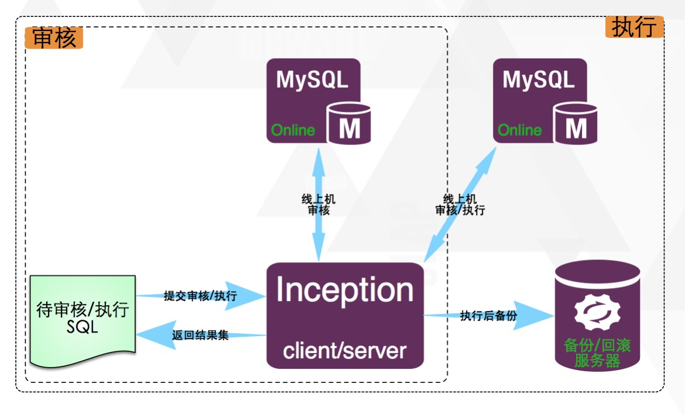

# Introdunction

[](https://github.com/hanchuanchuan/goInception/stargazers)
[](https://github.com/hanchuanchuan/goInception/network)
[](https://codecov.io/gh/hanchuanchuan/goInception)

[](https://github.com/hanchuanchuan/goInception/releases)


goInception is a MySQL maintenance tool, which can be used to review, implement, backup, and generate SQL statements for rollback. It parses SQL syntax and returns the result of the review based on custom rules.


## Architecture




## Usage

GoInception extension of the usage of Inception, to specify the remote server by adding annotations before the SQL review, and for distinguishing SQL and review adding special comments at the beginning and the end of SQL.

Any MySQL protocol-driven can connect in the same way, but the syntax is slightly different. Support different parameters to set for review by specific formats.

```sql
/*--user=root;--password=root;--host=127.0.0.1;--check=1;--port=3306;*/
inception_magic_start;
use test;
create table t1(id int primary key);
inception_magic_commit;
```

## What did

What audit rules goInception does, and what grammar audits are supported can be referred to [Audit rules](rules.html)


## Acknowledgments

GoInception reconstructs from the Inception which is a well-known MySQL auditing tool and uses TiDB SQL parser.

- [Inception](https://github.com/hanchuanchuan/inception)
- [TiDB](https://github.com/pingcap/tidb)
