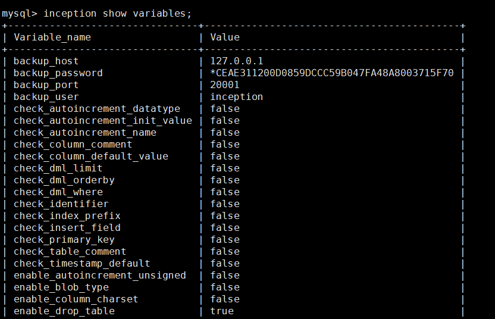
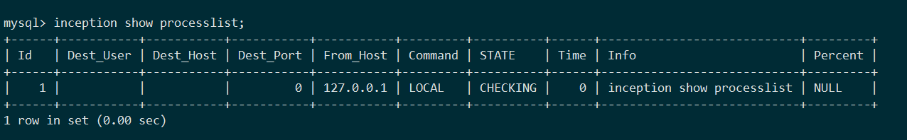

### python调用


```
pip install pymysql prettytable
```

```python
#!/usr/bin/env python
# -*- coding:utf-8 -*-

import pymysql
import prettytable as pt
tb = pt.PrettyTable()

sql = '''/*--user=root;--password=root;--host=127.0.0.1;--check=1;--port=3306;*/
inception_magic_start;
use test_inc;
create table t1(id int primary key,c1 int);
insert into t1(id,c1,c2) values(1,1,1);
inception_magic_commit;'''

conn = pymysql.connect(host='127.0.0.1', user='', passwd='',
                       db='', port=4000, charset="utf8mb4")
cur = conn.cursor()
ret = cur.execute(sql)
result = cur.fetchall()
cur.close()
conn.close()

tb.field_names = [i[0] for i in cur.description]
for row in result:
    tb.add_row(row)
print(tb)
```

返回结果：

order_id |  stage  | error_level |   stage_status   |         error_message        |                    sql                     | affected_rows |   sequence   | backup_dbname | execute_time | sqlsha1 | backup_time
----------|---------|----------|-----------------|-----------------------------|--------------------------------------------|---------------|--------------|---------------|--------------|-------------|---------
1     | CHECKED |    0     | Audit Completed |    None                         |                use test_inc                |       0       | 0_0_00000000 |      None     |      0       |   None |      0
2     | CHECKED |    0     | Audit Completed |    None                         | create table t1(id int primary key,c1 int) |       0       | 0_0_00000001 |      None     |      0       |   None |      0
3     | CHECKED |    2     | Audit Completed | Column 't1.c2' not existed. |   insert into t1(id,c1,c2) values(1,1,1)   |       1       | 0_0_00000002 |      None     |      0       |   None |      0


### 系统变量

连接
```bash
mysql -h127.0.0.1 -P4000
```

```sql
inception show variables;
```



### 进程列表

连接
```bash
mysql -h127.0.0.1 -P4000
```

```sql
inception show processlist;
```




### 中止进程(`*new`)

** 在审核和执行阶段可以kill,备份阶段不再允许kill ** `v0.6.2 新增`

相关链接： [kill 操作支持](https://github.com/hanchuanchuan/goInception/issues/10)

```bash
mysql -h127.0.0.1 -P4000
```

```sql
inception show processlist;
```

```sql
kill 2;
```


