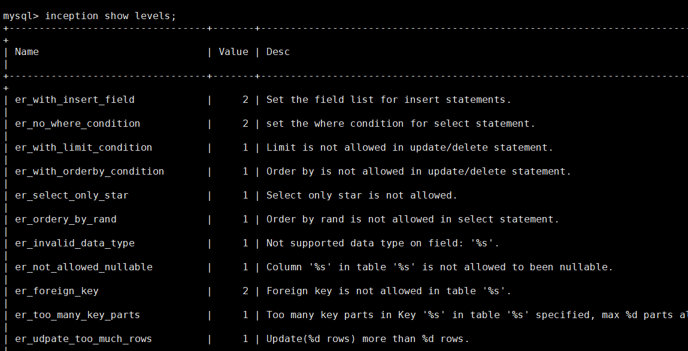
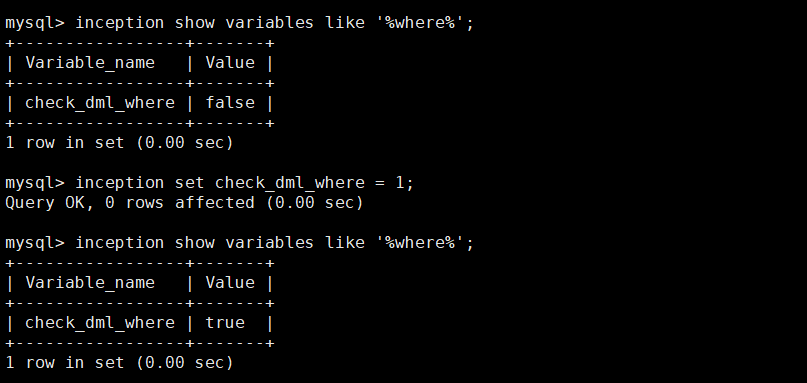

### 功能说明


自定义审核级别用以实现指定审核结果的错误级别。

对应审核结果的 `error_level` 字段：

- `2` 为错误，即强限制，无法执行
- `1` 为警告，即弱限制，可通过忽略警告参数`ignore_warnings`跳过
- `0` 为正常，即不做限制


##### 查看命令

```sql
inception show levels;
```

筛选查看
```sql
# 筛选指定审核名称
inception show levels like '%blob%';
# 筛选指定级别
inception show levels where value=2;
# 筛选指定关键字
inception show levels where `desc` like '%index%';
```



##### 设置审核级别命令

```sql
inception set level er_no_where_condition = 2;
```

##### 配置文件

** config.toml配置文件 **

*参数的可选值均为 `0`,`1`,`2`*
```
[inc_level]
er_alter_table_once = 1
er_auto_incr_id_warning = 1
er_autoinc_unsigned = 1
...
```

### 示例：实现限制 `delete语句必须有where条件`

1.开启where条件审核选项
```sql
inception show variables like '%where%';

inception set check_dml_where = 1;
```



2.设置where条件的审核级别为错误 (`2`)

```sql
inception show levels like '%where%';

inception set level er_no_where_condition = 2;
```


3.验证审核结果

