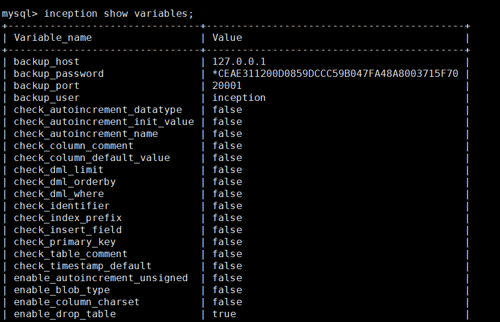

### 支持参数


goInception的审核规则可以通过```inception show variables;```查看

```sql
inception show variables;
```

支持以下方式设置:

- 1.通过```inception set ```设置

```sql
inception set check_dml_limit = true;
```

- 2.配置config.toml,并通过```-config=config.toml```指定配置文件启动





参数  |  默认值  |  可选范围 | 说明
------------ | ------------- | ------------ | ------------
check_autoincrement_datatype   |  false    |   true,false     |   当建表时自增列的类型不为int或者bigint时报错
check_autoincrement_init_value   |  false    |   true,false     |     当建表时自增列的值指定的不为1，则报错
check_autoincrement_name   |  false    |   true,false     |   建表时，如果指定的自增列的名字不为ID，则报错，说明是有意义的，给提示
check_column_comment   |  false    |   true,false     |   建表时，列没有注释时报错
check_column_default_value   |  false    |   true,false     |     检查在建表、修改列、新增列时，新的列属性是不是要有默认值
check_column_position_change `v0.9` |  false    |   true,false     |     检查列位置/顺序变更
check_column_type_change `v0.7.3` |  true    |   true,false     |  检查字段类型变更
check_dml_limit   |  false    |   true,false     |    在DML语句中使用了LIMIT时，是不是要报错
check_dml_orderby   |  false    |   true,false     |  在DML语句中使用了Order By时，是不是要报错
check_dml_where   |  false    |   true,false     |    在DML语句中没有WHERE条件时，是不是要报错
check_float_double `v1.0.2` |  false    |   true,false     |    开启时,当使用 `float/double` 类型时提示转成 `decimal` 类型
check_identifier  |  false    |   true,false     |    检查标识符是否正确,规则是[a-z,A-Z,0-9,_]
check_identifier_upper  `v1.0.2` |  false    |   true,false     |    要求标识符即表名、列名、索引名等必须为大写,默认为`false`
check_implicit_type_conversion `v1.1.3` | false | true,false | 检查where条件中是否存在隐式类型转换,默认值`false`
check_index_prefix   |  false    |   true,false     |     是不是要检查索引名字前缀为"idx_"，检查唯一索引前缀是不是"uniq_"
check_insert_field   |  false    |   true,false     |     是不是要检查插入语句中的列链表的存在性
check_primary_key   |  false    |   true,false     |  建表时，如果没有主键，则报错
check_table_comment   |  false    |   true,false     |    建表时，表没有注释时报错
check_timestamp_count `v0.6.0`   |  false    |   true,false     |    配置是否检查current_timestamp数量
check_timestamp_default   |  false    |   true,false     |    建表时，如果没有为timestamp类型指定默认值，则报错
default_charset `v1.0.5` | 'utf8mb4'    |   string  | 设置连接数据库的默认字符集,默认值为`utf8mb4` (解决低版本不支持utf8mb4的问题)
enable_autoincrement_unsigned   |  false    |   true,false     |  自增列是不是要为无符号型
enable_blob_not_null `v1.0` |  false    |   true,false     |   是否允许blob/text/json类型置为`not null`,默认为`false`,即不允许
enable_blob_type   |  false    |   true,false     |   检查是不是支持BLOB字段，包括建表、修改列、新增列操作
enable_change_column `v1.0.3` |  true    |   true,false     |   设置是否支持change column语法,默认值`true`
enable_column_charset   |  false    |   true,false     |  允许列自己设置字符集
enable_drop_database |  false    |   true,false     |  是否允许删除数据库
enable_drop_table   |  false    |   true,false     |  是否允许删除表
enable_enum_set_bit   |  false    |   true,false     |    是不是支持enum,set,bit数据类型
enable_fingerprint `v0.6.2`   |  false    |   true,false     |    sql指纹功能。dml语句相似时，可以根据相同的指纹ID复用explain结果，以减少远端数据库explain操作，并提高审核速度
explain_rule `v1.1.1`   |  "first"    |   "first", "max"     |    explain判断受影响行数时使用的规则(`"first", "max"`)。  `"first"`: 使用第一行的explain结果作为受影响行数, `"max"`: 		使用explain结果中的最大值作为受影响行数
enable_foreign_key   |  false    |   true,false     |     是不是支持外键
enable_identifer_keyword   |  false    |   true,false     |   检查在SQL语句中，是不是有标识符被写成MySQL的关键字，默认值为报警。
enable_json_type  `v0.7.2` |  false    |   true,false     |   设置是否允许json类型字段，包括建表、修改列、新增列操作
enable_minimal_rollback `v1.1.2` |  false    |   true,false     |   设置是否启用最小化回滚SQL，当开启时，update的回滚语句仅记录最小化变更(未变更列不再记录), 默认为`false`
enable_not_innodb  `v1.0-rc4 已删除`  |  false    |   true,false     |  `已删除!` 请使用 `enable_set_engine`和 `support_engine`以便于更灵活的指定存储引擎。 *建表指定的存储引擎不为Innodb，不报错*
enable_nullable   |  true    |   true,false     |    创建或者新增列时是否允许列为NULL
enable_null_index_name `v0.7.1`|  false    |   true,false     |    创建索引时是否允许空索引名
enable_orderby_rand   |  false    |   true,false     |    order by rand时是不是报错
enable_partition_table   |  false    |   true,false     |     是不是支持分区表
enable_pk_columns_only_int  |  false    |   true,false     |     是否强制主键列必须是int
enable_select_star   |  false    |   true,false     |     Select*时是不是要报错
enable_set_charset   |  false    |   true,false     |     是否允许指定表和数据库的字符集
enable_set_collation `v0.7` |  false    |   true,false     |     是否允许指定表和数据库的排序规则
enable_set_engine  `v1.0-rc4`  |  true    |   true,false     |     是否允许指定存储引擎,默认为`true`
enable_sql_statistic `v0.9` |  false    |   true,false     |     开启统计功能. 详见 **[统计功能](../statistics)**
enable_timestamp_type `v1.0.1` |  true    |   true,false     |    设置是否允许 `timestamp` 类型字段，包括建表、修改列、新增列操作，默认为 `true`
enable_zero_date `v1.0.1` |  true    |   true,false     |    设置是否支持时间为0值，关闭时强制报错。默认值为 `true`，即开启，此时会基于数据库sql_mode的NO_ZERO_DATE判断是否支持
general_log `v0.8.1` |  false    |   true,false     |     是否记录全量日志
hex_blob `v1.1.4` |  false    |   true,false     |     在解析binlog时,二进制类型如果无法以字符串形式保存,则以十六进制字符串转储(影响类型:binary,varbinary,blob),默认关闭
lang `v0.5.1` | en-US             | en-US,zh-CN | 返回的信息使用语言,可选值`en-US`,`zh-CN`
max_allowed_packet    `v1.0-rc3`            | 4194304              | int | 允许的最大数据包大小.默认为 `4194304`,单位字节,即4MB
max_char_length                | 0              | int | 最大char长度,当超出时警告转换为varchar类型
max_ddl_affect_rows `v1.0.2`   | 0              | int | 当DDL预估受影响行数超出设置值时警告,为0时不限制
max_insert_rows   `v0.6.3`              | 0           | int  | 设置insert values允许的最大行数.0为不限制
max_key_parts                  | 3              | int  | 一个索引最多可指定的列数
max_keys                       | 3              | int | 单表允许的最大索引数
max_primary_key_parts          | 3              | int | 主键最多可指定的列数
max_update_rows                | 5000           | int  | 当update/delete预估受影响行数超出设置值时警告
merge_alter_table   |  false    |   true,false     |  在多个改同一个表的语句出现是，报错，提示合成一个
must_have_columns  `v0.6.3` | ''    |   string  | 用以指定建表时必须创建的列。多个列时以逗号分隔(`格式: 列名 [列类型,可选]`)
skip_sqls `v1.0-rc3` | ''    |   string  | 指定不再审核的SQL.该参数指定要跳过的客户端/框架默认SQL,以实现客户端兼容
sql_safe_updates               | -1              |  -1,0,1  | 安全更新.-1表示不做操作,基于远端数据库,0表示关闭安全更新,1表示开启安全更新
support_charset | utf8,utf8mb4              | string | 支持的字符集,多个时以逗号分隔
support_collation `v0.7` | ''             | string | 支持的排序规则,多个时以逗号分隔
support_engine `v1.0-rc4` | 'innodb'    |   string  | 支持的存储引擎类型.默认为`innodb`,此处可以设置多个,以逗号分隔,或者修改默认的存在引擎类型
wait_timeout `v1.1.2` | 0      | int | 远端数据库等待超时时间, 单位:秒, 默认值为 `0` 时表示使用数据库默认值


<!--
inception_read_only     设置当前Inception服务器是不是只读的，这是为了防止一些人具有修改权限的帐号时，通过Inception误修改一些数据，如果inception_read_only设置为ON，则即使开了enable-execute，同时又有执行权限，也不会去执行，审核完成即返回
 -->
