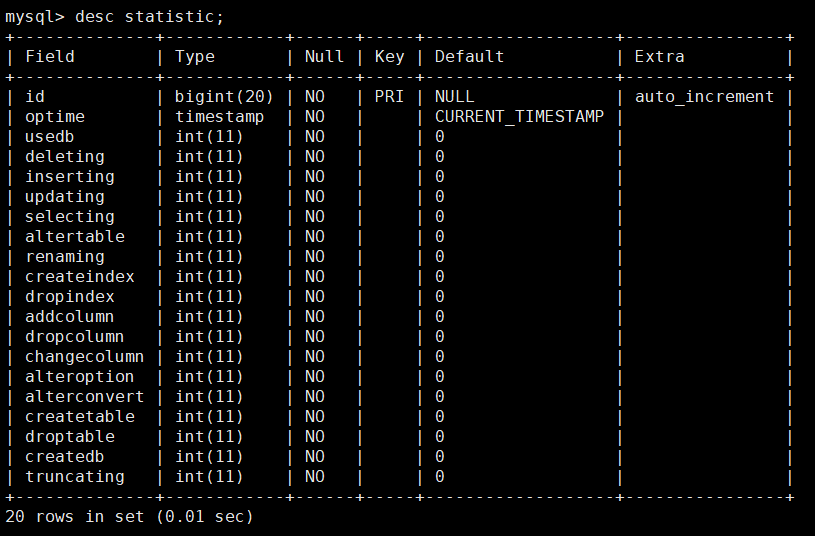

# 统计功能

统计功能用以记录操作占比，通过参数 `enable_sql_statistic` 开启。

除了上面的参数之外，使用这个功能还需要开启操作备份功能，因为这些统计数据需要存储到备份数据库中，存储的数据库名为inception中，
这个数据库现在只有一个表statistic，存储的就是SQL执行数目的统计数据。


**statistic**表的结构如下：


从每一个列的名字就可以看到，其值对应的操作是什么，每一个列就是一个自增列，第二个列optime是操作时间，这个主要是用来统计在某一段时间内的某一个操作占多少比例。

部分列说明：

* **deleting** : 包括普通的删除操作及多表删除操作。
* **inserting** : 包括单行插入、多行插入及查询插入。
* **updating** : 包括普通单表更新及多表的更新。
* **renaming** : 指的是ALTER table语句中的rename操作。
* **createindex** : 指的是ALTER table语句中的add index操作。
* **dropindex** : 指的是ALTER table语句中的drop index操作。
* **alteroption** : 指的是ALTER table语句中的修改表属性的操作，比如存储引擎、自增值及字符集中操作。
* **alterconvert** : 指的是ALTER table语句中修改表字符集的操作。

对于ALTER TABLE操作，因为这个操作包含很多的子操作，比如rename、drop index、engine innodb等操作，所以对于列altertable，它的值是renaming, createindex, dropindex, addcolumn, dropcolumn, changecolumn, alteroption, alterconvert的和, 而后面的是对ALTER TABLE语句的细分操作统计。

那么如果现在想要统计某一个操作，比如修改表占所有操作的百分比，则使用如下语句即可完成：
````
select sum(a.oprate)/count(1) updaterate from
(select (updating)/(usedb+deleting+inserting+updating+selecting+altertable+
createtable+droptable+createdb+truncating) oprate from
inception.statistic) a;
````

# 说明

* 只是审核操作，或者审核失败未执行时，不会进行操作统计。
* goInception会记录实际执行的数据，即如果执行一部分后失败时，只记录实际执行的操作。
* 备份出错导致提前返回时，不会影响统计信息。
