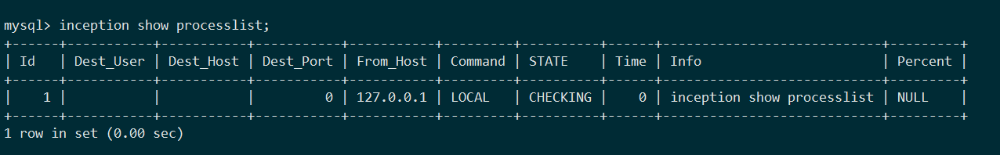

# 示例

### python调用


```
pip install pymysql prettytable
```

```python
#!/usr/bin/env python
# -*- coding:utf-8 -*-

import pymysql
import prettytable as pt
tb = pt.PrettyTable()

sql = '''/*--user=root;--password=root;--host=127.0.0.1;--check=1;--port=3306;*/
inception_magic_start;
use test_inc;
create table t1(id int primary key,c1 int);
insert into t1(id,c1,c2) values(1,1,1);
inception_magic_commit;'''

conn = pymysql.connect(host='127.0.0.1', user='', passwd='',
                       db='', port=4000, charset="utf8mb4")
cur = conn.cursor()
ret = cur.execute(sql)
result = cur.fetchall()
cur.close()
conn.close()

tb.field_names = [i[0] for i in cur.description]
for row in result:
    tb.add_row(row)
print(tb)
```

返回结果：

order_id |  stage  | error_level |   stage_status   |         error_message        |                    sql                     | affected_rows |   sequence   | backup_dbname | execute_time | sqlsha1 | backup_time
----------|---------|----------|-----------------|-----------------------------|--------------------------------------------|---------------|--------------|---------------|--------------|-------------|---------
1     | CHECKED |    0     | Audit Completed |    None                         |                use test_inc                |       0       | 0_0_00000000 |      None     |      0       |   None |      0
2     | CHECKED |    0     | Audit Completed |    None                         | create table t1(id int primary key,c1 int) |       0       | 0_0_00000001 |      None     |      0       |   None |      0
3     | CHECKED |    2     | Audit Completed | Column 't1.c2' not existed. |   insert into t1(id,c1,c2) values(1,1,1)   |       1       | 0_0_00000002 |      None     |      0       |   None |      0

### go调用

```
GO111MODULE=on go run test.go
```

**test.go：**
```go
package main

import (
	"database/sql"
	"fmt"
	_ "github.com/go-sql-driver/mysql"
	"github.com/syohex/go-texttable"
	"log"
)

func main() {

	db, err := sql.Open("mysql", "root:@tcp(127.0.0.1:4000)/")
	defer db.Close()

	sql := `/*--user=test;--password=test;--host=127.0.0.1;--port=3306;--check=1;*/
    inception_magic_start;
    use  test;
    create table t1(id int primary key);
    alter table t1 add index idx_id (id);
    create table t2(jid int primary key);
    inception_magic_commit;`

	rows, err := db.Query(sql)
	if err != nil {
		log.Fatal(err)
	}
	defer rows.Close()

	cols, err := rows.Columns()
	if err != nil {
		log.Fatalln(err)
	}
	fmt.Println(cols)
	tbl := &texttable.TextTable{}

	tbl.SetHeader(cols[0], cols[1], cols[2], cols[3], cols[4], cols[5], cols[6], cols[7], cols[8], cols[9], cols[10], cols[11])

	for rows.Next() {
		var order_id, affected_rows, stage, error_level, stage_status, error_message, sql, sequence, backup_dbname, execute_time, sqlsha1, backup_time []uint8
		err = rows.Scan(&order_id, &stage, &error_level, &stage_status, &error_message, &sql, &affected_rows, &sequence, &backup_dbname, &execute_time, &sqlsha1, &backup_time)
		tbl.AddRow(string(order_id), string(affected_rows), string(stage), string(error_level), string(stage_status), string(error_message), string(sql), string(sequence), string(backup_dbname), string(execute_time))
		// tbl.AddRow(string(nil_process(sqlsha1)))
	}
	fmt.Println(tbl.Draw())
}

```

### 结果集说明

详见 [结果集说明](result.html)


### 系统变量

连接
```bash
mysql -h127.0.0.1 -P4000
```

```sql
inception show variables;
```


### 进程列表

连接
```bash
mysql -h127.0.0.1 -P4000
```

```sql
inception show processlist;
```




### 中止进程(`*new`)

** 在审核和执行阶段可以kill,备份阶段不再允许kill ** `v0.6.2 新增`

相关链接： [kill 操作支持](https://github.com/hanchuanchuan/goInception/issues/10)

```bash
mysql -h127.0.0.1 -P4000
```

```sql
inception show processlist;
```

```sql
kill 2;
```


