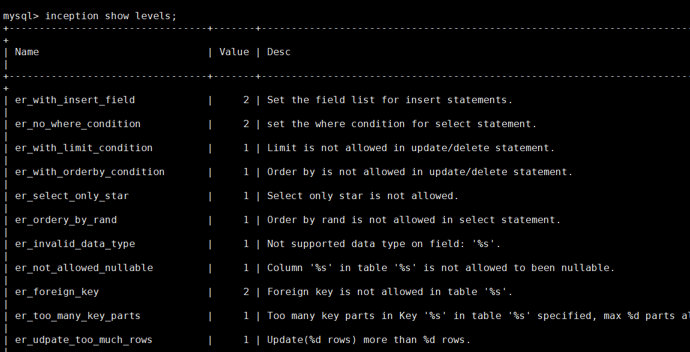
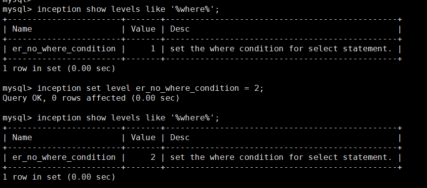

### function description

Customize audit level for setting the audit error lever `error_level`.
- `2` is error, force probit
- `1` is warning, weak probit, can by ignored by the setting ignore_warnings.
- `0` is correct.


### check levels

```sql
inception show levels;
```

check demo
```sql
inception show levels like '%blob%';
inception show levels where value=2;
inception show levels where `desc` like '%index%';
```



### Setting audit level

```sql
inception set level er_no_where_condition = 2;
```

#### Configuration file

**config.toml**

*Options: `0`,`1`,`2`*
```
[inc_level]
er_alter_table_once = 1
er_auto_incr_id_warning = 1
er_autoinc_unsigned = 1
...
```

### deno：limit `delete must contain where`

1.turn on `where` audit option
```sql
inception show variables like '%where%';

inception set check_dml_where = 1;
```


2.setting where audit level is (`2`)

```sql
inception show levels like '%where%';

inception set level er_no_where_condition = 2;
```




