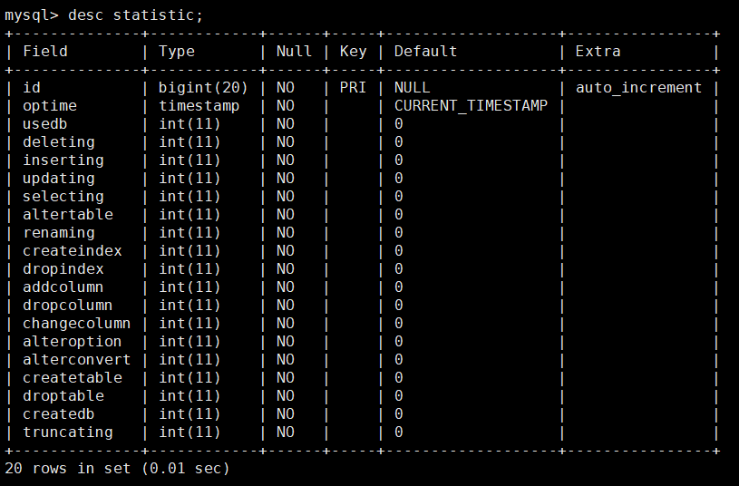

# Statistics function

For percentage of recorded operations, set by `enable_sql_statistic` and need to turn on backup, because statistics data is stored in the backup database. Schema name is inception, and this schema has only one table `statistic`.



Partial Column comment
- **deleting** : Including the common deletion and multi-table delete operation
inserting : Including single-row inserts, multi-row insert and insert query
- **updating** : Including updates ordinary single-table and multi-table update
- **renaming** : rename in `ALTER table`
- **createindex** : add index in `ALTER table`
- **dropindex** : drop index in `ALTER table`
- **alteroption** : some modify table options in `ALTER table`, such as storage `engines, auto_increment`, character.
- **alterconvert** : modify character in `ALTER table`
For `ALTER TABLE`, maybe contains multi-options, such as rename, drop index, engine innodb, etc. the value is the sum value of renaming, createindex, dropindex, addcolumn, dropcolumn, changecolumn, alteroption, alterconvert.

If you want to calculate some specific option, you can check below.
````
select sum(a.oprate)/count(1) updaterate from
(select (updating)/(usedb+deleting+inserting+updating+selecting+altertable+
createtable+droptable+createdb+truncating) oprate from
inception.statistic) a;
````

# Tips

* If only audit options or audit failed, won’t be calculated in statistics.
* goInception only records the actual execution option.if partial failed, only records the success part.
* If the error is caused by backup, it won't affect statistics.

